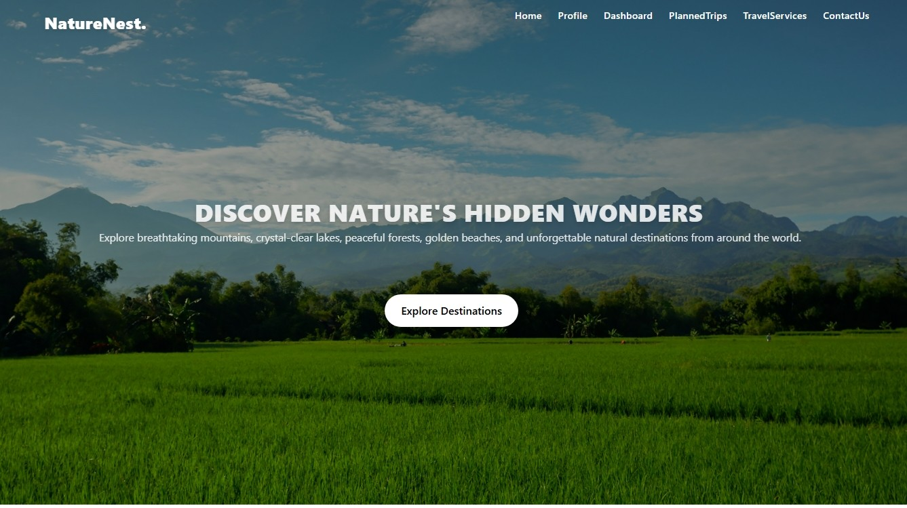
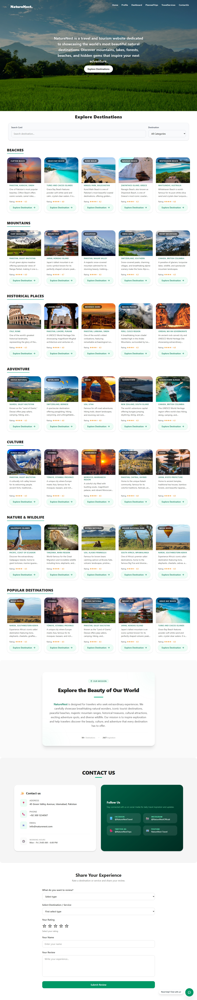
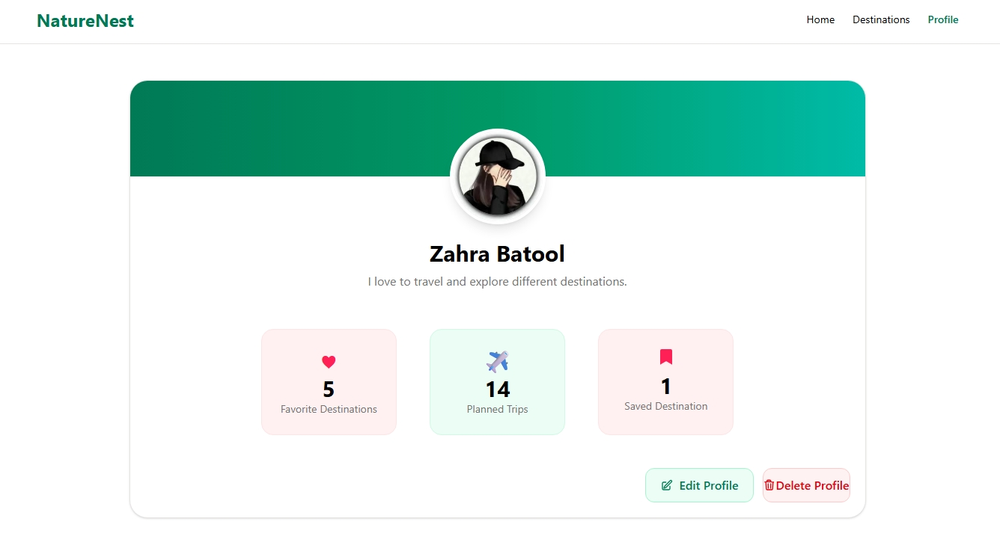
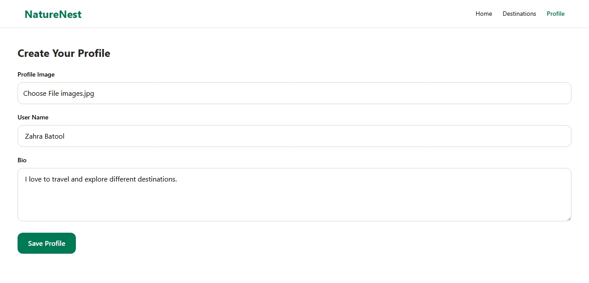
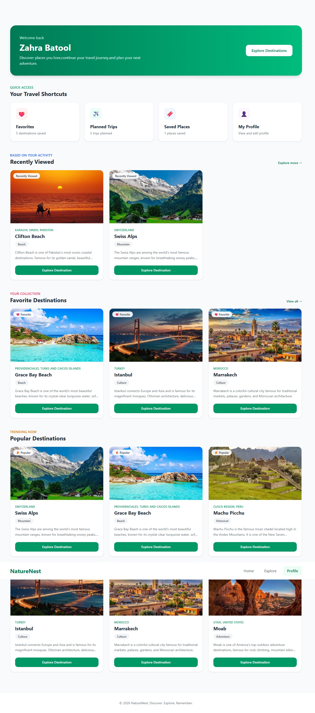
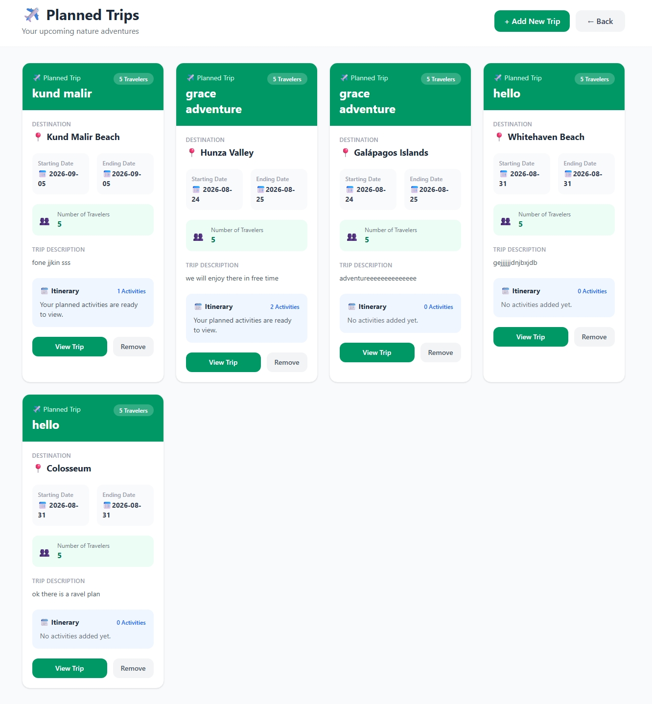
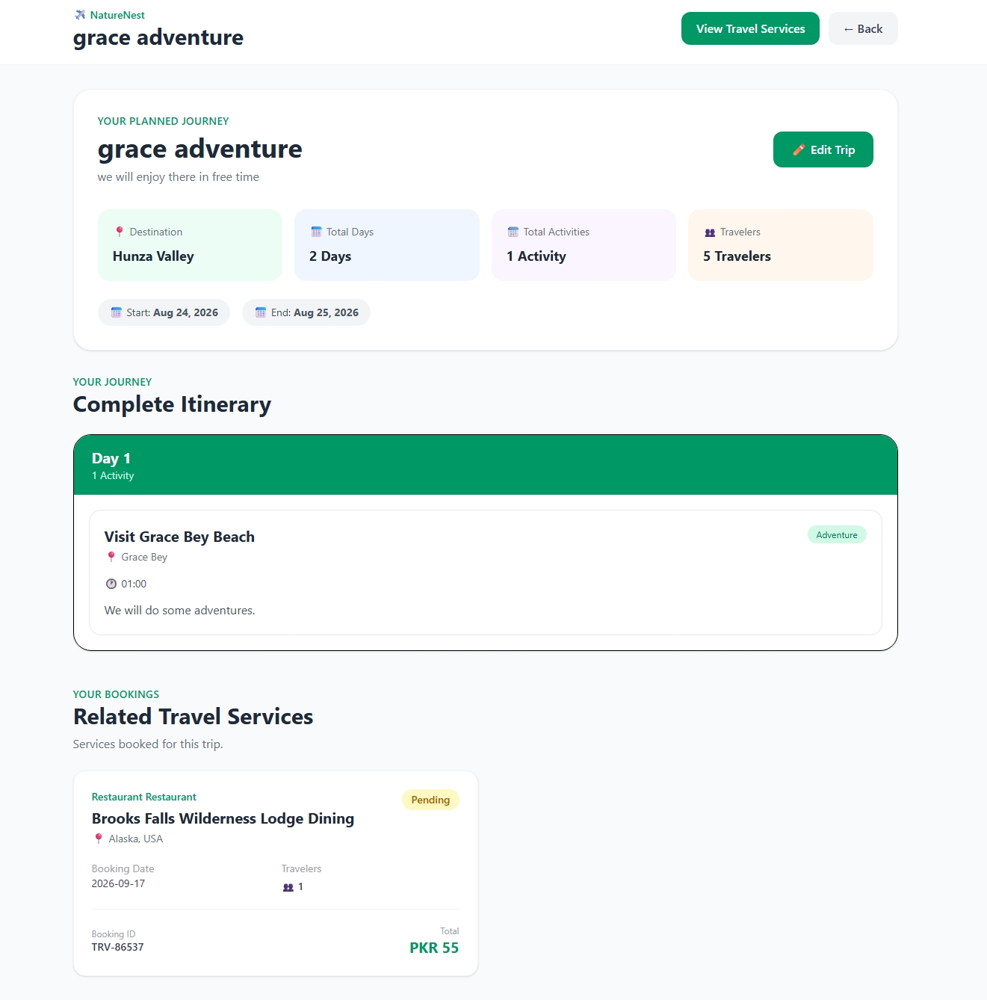
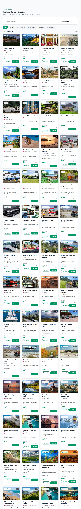

# NatureNest 🌍 - Travel & Tourism Website

NatureNest is a modern, fully responsive travel and tourism website that helps users discover beautiful destinations from around the world.

The website allows users to explore beaches, mountains, historical places, cultural destinations, adventure spots, and nature & wildlife locations through an attractive and user-friendly interface.

It is built using **HTML5**, **Tailwind CSS**, and **Vanilla JavaScript**, focusing on responsive design, smooth user experience, and dynamic functionality.

## ✨ Features

### 📱 Fully Responsive Design

* Mobile-first responsive layout
* Optimized for mobile, tablet, laptop, and desktop screens
* Flexible layouts using Tailwind CSS

### 🌍 Explore Destinations

Users can explore destinations from different categories:

* 🏖️ Beaches
* 🏔️ Mountains
* 🏛️ Historical Places
* 🧗 Adventure Destinations
* 🕌 Cultural Destinations
* 🦁 Nature & Wildlife

### 🔍 Dynamic Destination Filtering

Users can filter destinations by category without reloading the page. Each destination also has a dedicated details page generated dynamically using JavaScript.

### ❤️ Favorites, Saved & Planned Trips

Users can:

* Add and remove favorite destinations
* Save destinations for later
* Add destinations to Planned Trips
* View their saved and planned destinations
* Store selections using localStorage

### 📅 Day-by-Day Itinerary

Users can create and save a **day-by-day travel itinerary** to organize activities and plans for their trip.

### 🏨 Travel Services

NatureNest provides different travel services, including:

* 🏨 Hotels
* 🚗 Transportation
* ✈️ Other travel-related services

Users can explore available services and manage their travel plans.

### 🎫 Booking System

Users can book available travel services through the website, making it easier to organize different parts of their trip.

### ⭐ Reviews & Ratings

Users can give **ratings and reviews** for destinations and services. Ratings are calculated dynamically and displayed with the related destination or service.

### 🧭 Personalized Recommendations

A travel preference form allows users to enter their:

* Budget
* Travel type
* Trip duration
* Preferred destination category
* Number of travelers

Based on these preferences, the website dynamically recommends suitable destinations.

### 🤖 Travel Assistant Chatbot

An interactive chatbot helps users with predefined travel questions such as:

* Where should I travel?
* What can I do there?
* Which destinations are suitable for a low budget?
* Which destinations are suitable for families?

### 📖 About Us

An About Us section introduces NatureNest and its mission of promoting travel, tourism, and exploration.

### 📞 Contact

A contact section provides sample:

* Email
* Phone Number
* Address

## 🛠️ Built With

* HTML5
* Tailwind CSS
* Vanilla JavaScript
* LocalStorage

## Images

## 📂 Project Structure 

travel-torism/ 
│
├── src/ 
│    ├── assets/ 
│    │   ├── Beaches/ 
│    │   ├── Mountains/ 
│    │   ├── Historical/ 
│    │   ├── Adventure/ 
│    │   ├── Culture/ 
│    │   ├── Nature & Wildlife/ 
│    │   ├── services/ 
│    │ 
│    ├──app.js 
│    ├── assistant-logic.js  
│    ├── booking.js 
│    ├──counter.js 
│    ├── dashboard.js  
│    ├── destination.js  
│    ├── destination-data.js 
│    ├── dynamic-destination.js  
│    ├── favorites.js  
│    ├── index.js 
│    ├── itinerary.js 
│    ├── main.js 
│    ├── planned-trips.js 
│    ├── profile.js  
│    ├── recommendation.js 
│    ├── review.js 
│    ├── saved.js 
│    ├── service-details.js 
│    ├── services-data.js 
│    ├── style.css  
│    ├── travel-services.js 
│    ├── trip.js 
│    └── trip-details.js 
│ 
├──  booking.html 
├──  booking-confirmation.html 
├── dashboard.html 
├── explore-destination.html 
├── favorites.html 
├── index.html 
├── itinerary.html 
├── planned-trips.html 
├── profile.html 
├── recommendation.html 
├── saved.html 
├── service-details.html 
├── travel-services.html 
├──trip-details 
└── README.md 

## 👩‍💻 Author 

**Haadia Batool** 
