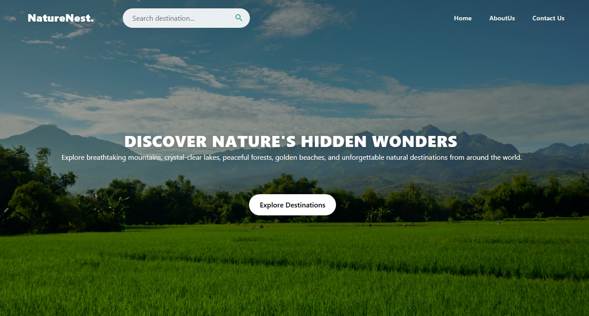
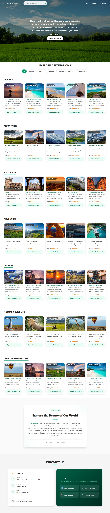
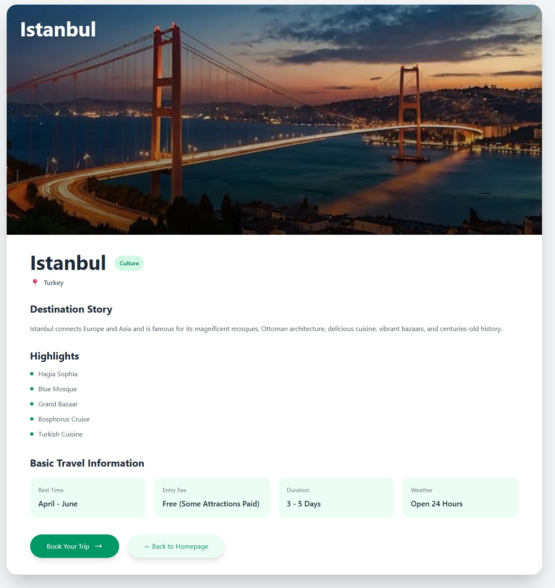
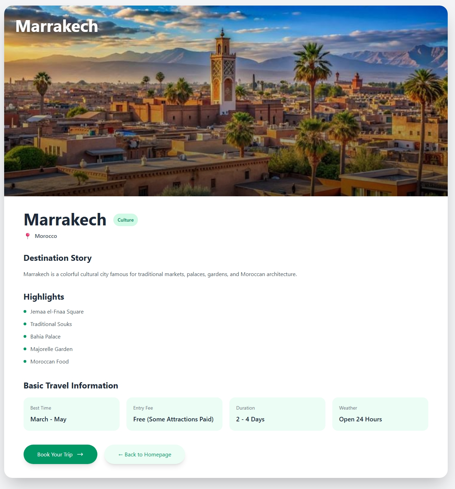

# NatureNest 🌍 - Travel & Tourism Website 

NatureNest is a modern, fully responsive travel and tourism website that helps users discover beautiful destinations from around the world.
The website showcases famous beaches, mountains, historical places, cultural destinations, adventure spots, and nature & wildlife locations through an attractive and user-friendly interface. 

It is built using **HTML5**, **Tailwind CSS**, and **Vanilla JavaScript**, focusing on responsive design, smooth user experience, and dynamic destination filtering. 

## ✨ Features 

### 📱 Fully Responsive Design 

- Mobile-first responsive layout 
- Optimized for mobile phones, tablets, laptops, and desktop screens 
- Flexible grid system built with Tailwind CSS 

### 🌍 Explore Destinations 

Browse destinations from different travel categories: 

- 🏖️ Beaches 
- 🏔️ Mountains 
- 🏛️ Historical Places 
- 🧗 Adventure Destinations 
- 🕌 Cultural Destinations 
- 🦁 Nature & Wildlife 

 ### 🔍 Dynamic Destination Filtering 

The website includes category filter buttons that allow users to instantly view destinations by category. 

### 📖 Explore Destination Page 
Each destination card contains an **Explore Destination** button. 

When a user clicks the button: 

- A dedicated destination details page opens. 
- The page is generated dynamically using JavaScript. 

Examples: 

- Clicking **Beaches** displays only beach destinations. 
- Clicking **Mountains** displays only mountain destinations. 
- Clicking **Historical Places** displays only historical destinations. 
- Clicking **Adventure** displays only adventure destinations. 
- Clicking **Culture** displays only cultural destinations. 
- Clicking **Nature & Wildlife** displays only wildlife and nature destinations. 

Filtering happens dynamically using **JavaScript** without reloading the page. 

### 📖 About Us Section 

The website contains an About Us section introducing NatureNest's mission of promoting travel, tourism, and exploration of natural and cultural destinations around the world. 

### 📞 Contact Section 

A clean contact section provides sample contact information including: 

- Email 
- Phone Number 
- Address 

## 🛠️ Built With 

- HTML5 
- Tailwind CSS 
- JavaScript 

## Images

## 📂 Project Structure 

travel-torism/ 
│
├── src/ 
│   ├── assets/ 
│   │   ├── Beaches/ 
│   │   ├── Mountains/ 
│   │   ├── Historical/ 
│   │   ├── Adventure/ 
│   │   ├── Culture/ 
│   │   ├── Nature & Wildlife/ 
│   │
│   ├── style.css 
│   └── main.js 
│   └── dynamic-destination.js
│    └──destination.js
├── index.html 
├──explore-destination.html
├── package.json 
├── tailwind.config.js 
├── vite.config.js 
└── README.md 

## 👩‍💻 Author 

**Haadia Batool** 
